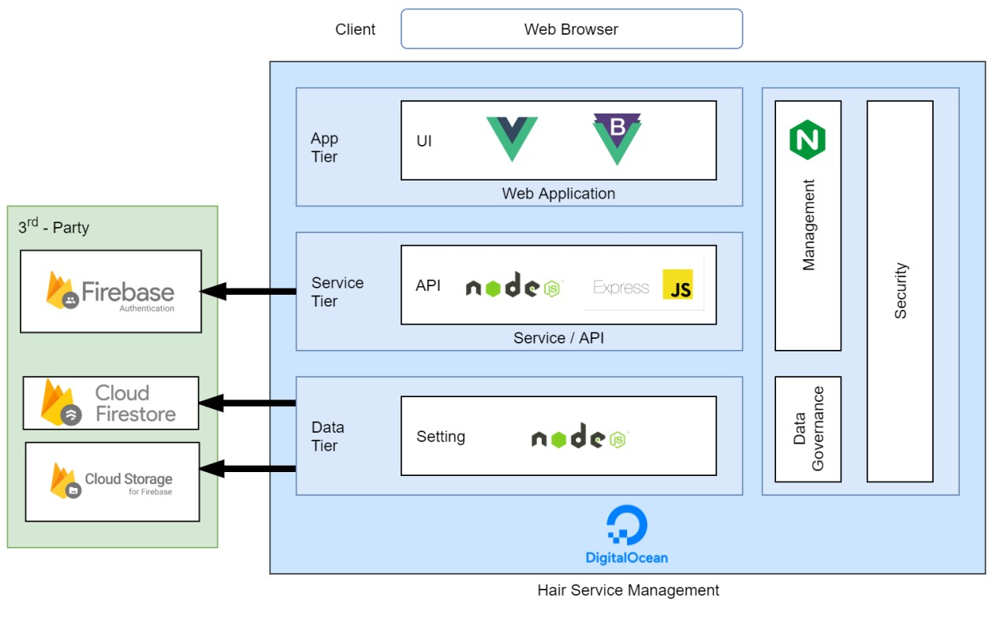

# Hairzer

Hair Service Management, Web Application in Software Development Processes course. You can read a project document (Thai ver.) [here](https://drive.google.com/file/d/1ZdNcxaSHjy7YGSQKxxRlirUyFaTKXsjF/view?usp=sharing)

## Table of Project Document

- Background
- Requirements
- UX/UI Design
- System Design
  - Data Flow Diagram
  - BPMN
  - Software Architecture
  - ER Diagram
- System Development
- System Testing

## Architecture



## Screenshot


## Project Setup

### Front-end Hairzer

```cmd
npm install
npm run serve
```

### Back-end Hairzer

```cmd
cd server
npm install
npm run dev
```

## Reference

- [Vue.js](https://cli.vuejs.org/config/)
- [BootstrapVue](https://bootstrap-vue.org/)
- [Express.js](https://expressjs.com/)
- [Firebase](https://firebase.google.com/)
- [Docker](https://www.docker.com/)
